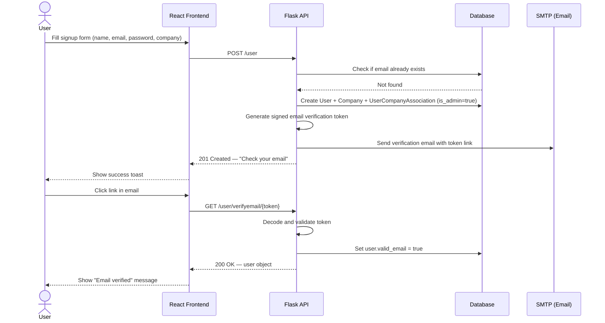
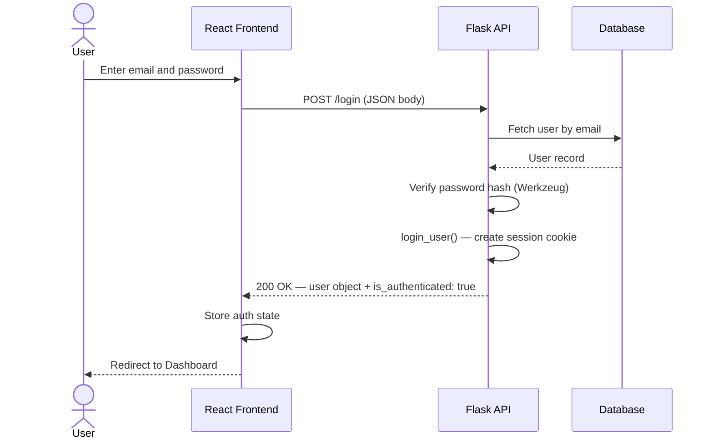
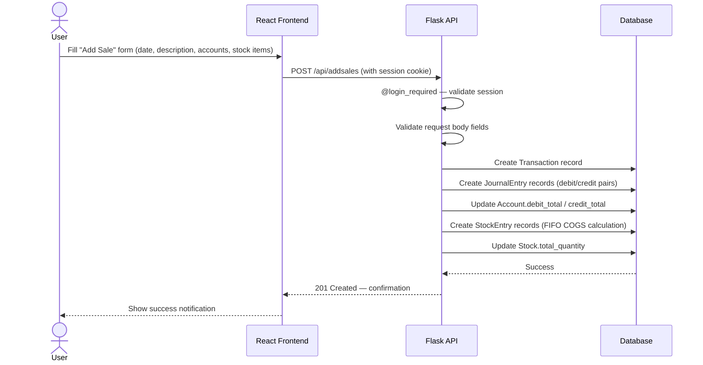
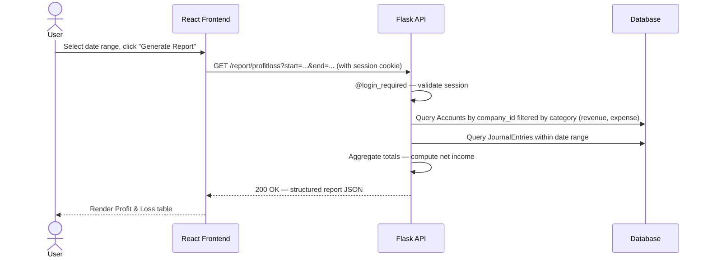
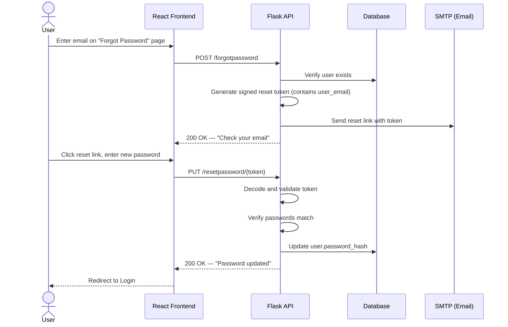

# Application Flow

This document describes the key user journeys in AccoTrac and illustrates them with sequence diagrams.

---

## 1. User Registration & Email Verification

---

## 2. Login Flow

---

## 3. Recording a Transaction (e.g., a Sale)

---

## 4. Generating a Report (e.g., Profit & Loss)

---

## 5. Password Reset Flow

---

→ Back to [docs index](../README.md)
