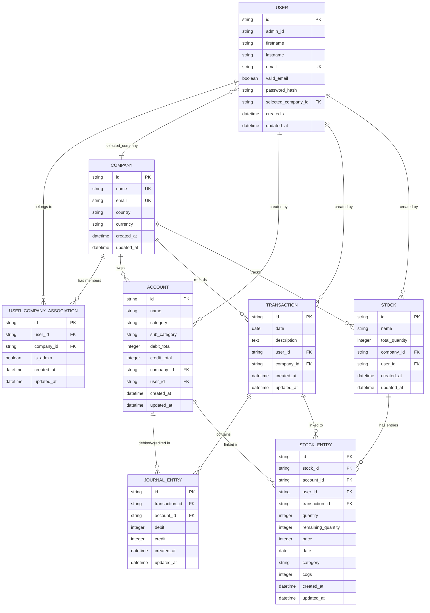

# Database Schema

AccoTrac uses a relational database (SQLite in development, MySQL in production) managed via SQLAlchemy ORM with Alembic migrations.

---

## Entity-Relationship Diagram

---

## Table Descriptions

### `user`
Stores registered user accounts. Each user has a hashed password and can belong to multiple companies.

- `selected_company_id` — The currently active company for this user's session context.
- `valid_email` — Set to `true` after the user clicks the email verification link.
- `admin_id` — Tracks which admin created/invited this user (`'0'` = self-registered).

### `company`
Represents a business entity. A user can create or be invited to multiple companies.

### `user_company_association`
Junction table implementing the **many-to-many** relationship between users and companies.

- `is_admin` — If `true`, the user has admin privileges within that company (can invite others, edit company info).

### `account`
A ledger account belonging to a company. Uses standard double-entry categories.

**Account categories:**
| Category | Balance Direction |
|---|---|
| `asset` | Debit balance (debit_total − credit_total) |
| `expense` | Debit balance |
| `revenue` | Credit balance (credit_total − debit_total) |
| `liability` | Credit balance |
| `capital` | Credit balance |

### `transaction`
A business event (e.g., a sale, a purchase). Contains one or more journal entries.

### `journal_entry`
A single line within a transaction — records which account is debited or credited and by how much.

> **Double-entry rule**: The sum of all debits must equal the sum of all credits within a transaction.

### `stock`
An inventory item tracked by the company.

- `total_quantity` — Running balance of units in hand.

### `stock_entry`
A record of stock movement (purchase in or sale out).

- `category` — Either `"purchase"` or `"sales"`.
- `remaining_quantity` — Units still available from this batch (used for FIFO cost calculation).
- `cogs` — Cost of Goods Sold calculated at time of sale using the FIFO method.

---

## FIFO Stock Costing

When a sale is recorded, the `Stock.get_sorted_purchase_entries()` method returns purchase batches sorted by date (oldest first). Units are deducted from the earliest batch first, and COGS is calculated proportionally per batch. This implements the **First-In, First-Out (FIFO)** inventory costing method.

---

→ Back to [docs index](../README.md)
