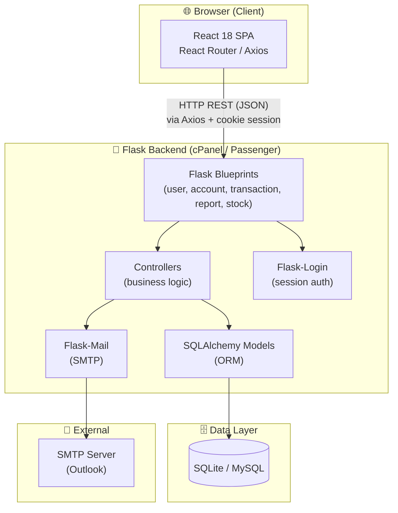

# System Overview

AccoTrac follows a **REST API + Single Page Application** architecture with a clear separation between frontend, backend, and data layers.

---

## Component Diagram

---

## Area Separation

| Area | Description | Authentication |
|---|---|---|
| **Public** | Landing page, About, Contact, Login, Signup | Not required |
| **User Area** | Dashboard, Accounts, Journal, Reports, Profile, Stock | Required (Flask-Login session) |

---

## Request Lifecycle

1. User action in React triggers an **Axios** HTTP request.
2. Flask receives the request, checks the **session cookie** via Flask-Login.
3. The appropriate **Blueprint route** delegates to a **Controller**.
4. The Controller queries/mutates data via **SQLAlchemy Models**.
5. A **JSON response** is returned to React.
6. React updates state and re-renders the UI.

---

## Key Design Decisions

| Decision | Rationale |
|---|---|
| Flask Blueprints | Modular routing — separates user, account, transaction, report concerns |
| SQLAlchemy ORM | Database-agnostic (SQLite for dev, MySQL for prod) |
| Server-side sessions | Simple to implement; Flask-Login handles session lifecycle |
| Async email sending | Email is dispatched in a background thread to avoid blocking HTTP responses |
| React SPA | Decoupled frontend — can be deployed independently as static files |

---

→ Back to [docs index](../README.md)
