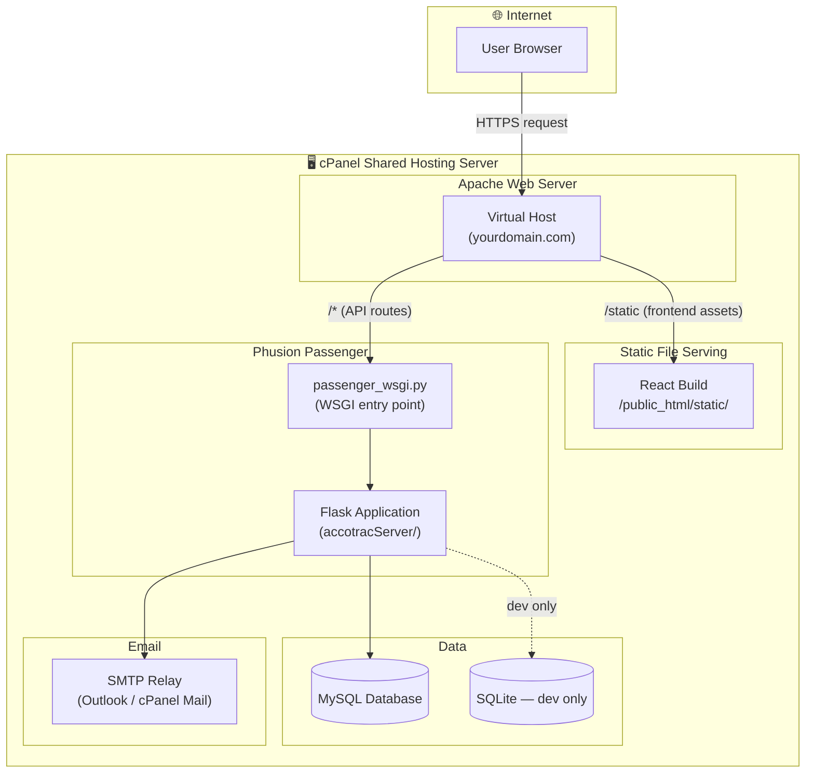

# Deployment Architecture

AccoTrac is deployed on a **shared hosting environment (cPanel)** with Phusion Passenger serving the Flask backend and static files serving the React frontend.

---

## Deployment Diagram

---

## Request Routing

| Path | Handled By |
|---|---|
| `/` (root + static files) | Apache serves React build (`/public_html/`) |
| `/api/*`, `/user`, `/login`, etc. | Phusion Passenger → `passenger_wsgi.py` → Flask |

---

## Deployment Steps (Backend)

1. SSH into cPanel server.
2. `cd` into the `accotracServer/` directory (deployed separately from `backend/`).
3. Pull latest changes: `git pull origin main`
4. Activate virtual environment: `source venv/bin/activate`
5. Install new dependencies: `pip install -r requirements.txt`
6. Run migrations: `flask db upgrade`
7. **Restart Passenger**: `touch tmp/restart.txt` — Passenger detects this and reloads the app.

## Deployment Steps (Frontend)

1. Locally, run `npm run build` in `frontend/accotrac/`.
2. Upload the `/build` directory contents to cPanel via FTP or File Manager.
3. Files go into the domain's `public_html/` directory.

---

→ See [`hosting.md`](hosting.md) for platform configuration details.  
→ Back to [docs index](../README.md)
