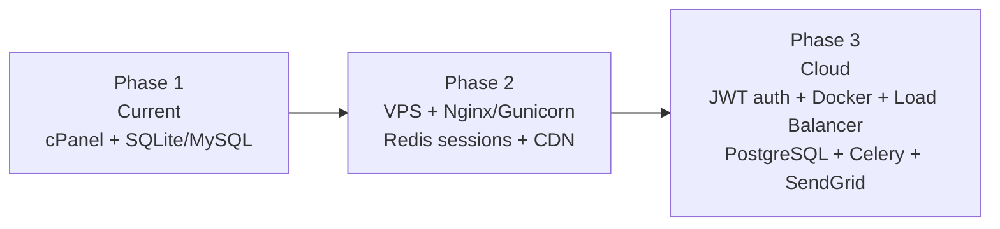

# Scalability Considerations

This document outlines the current architectural constraints of AccoTrac and recommends a path for scaling as the user base grows.

---

## Current Architecture Assessment

| Component | Current State | Scalability Rating |
|---|---|---|
| Database | SQLite (dev) / MySQL (prod) | 🟡 Moderate — MySQL scales well with proper indexing |
| Backend | Flask on Phusion Passenger (single cPanel server) | 🟠 Limited — single server, no horizontal scaling |
| Session storage | Server-side sessions (Flask-Login) | 🔴 Poor — sessions are tied to a single server instance |
| Frontend | Static React build on Apache | 🟢 Good — static files can be moved to a CDN |
| Email | SMTP with background threads | 🟡 Moderate — suitable for low volume; not for bulk |

---

## Database

### Current
- **SQLite** is used in development — a file-based database that does not support concurrent writes well.
- **MySQL** in production — handles concurrent reads well; write-heavy workloads benefit from proper indexing.

### Current Indexes
The `Account` model has indexes on `category` and `sub_category`:
```python
category = db.Column(db.String(255), nullable=False, index=True)
sub_category = db.Column(db.String(255), index=True)
```

### Recommendations
- Add a composite index on `(company_id, category)` in `Account` — the most common query pattern for reports.
- Add an index on `Transaction.date` for date-range report queries.
- Consider **PostgreSQL** over MySQL for its better support for complex aggregate queries.
- Enable SQLAlchemy **connection pooling** for the production database.

---

## Backend / Server

### Current
- Single Flask process managed by Phusion Passenger on a shared cPanel server.
- Passenger supports multiple worker processes, but all share the same server.

### Limitations
- **Vertical scaling only** — you can increase server RAM/CPU, but not easily distribute across multiple machines.
- **Stateful sessions** — Flask-Login stores sessions server-side (in the process memory / filesystem). If you run multiple Passenger workers, they don't share session state.

### Recommendations

#### Short-term (cPanel)
- Configure Passenger to allow multiple worker processes (`PassengerMaxPoolSize`).
- Ensure sessions use a shared store if multiple workers are running (e.g., Redis via `flask-session`).

#### Medium-term (VPS / Cloud)
- Migrate from cPanel to a VPS (DigitalOcean, Linode) with Nginx + Gunicorn or uWSGI.
- Use **Redis** for session storage (`flask-session` + `redis`).

#### Long-term
- Transition from session-based auth to **JWT tokens** — stateless tokens enable true horizontal scaling.
- Containerise the backend with Docker.
- Use a cloud load balancer (AWS ALB, DigitalOcean Load Balancer).

---

## Frontend

### Current
- React SPA served as static files from Apache.
- All bundle assets are minified and hashed by Create React App.

### Recommendations
- **Move static assets to a CDN** (Cloudflare, AWS CloudFront, or Bunny CDN).
- This reduces load on the cPanel server and improves global load times significantly.
- Set long-lived `Cache-Control` headers for hashed asset files.

---

## Email Sending

### Current
- Emails are sent in a **background Python thread** to avoid blocking HTTP responses:
  ```python
  Thread(target=send_async_email, args=(app, msg)).start()
  ```
- This is adequate for low-volume transactional email (verification, password reset).

### Limitations
- If the Flask process crashes, in-flight emails are lost.
- Not suitable for bulk or marketing emails.

### Recommendations
- Use a managed transactional email service: **SendGrid**, **Mailgun**, or **AWS SES**.
- For reliability, introduce a **task queue** (e.g., Celery + Redis) to handle email sending asynchronously with retry logic.

---

## Multi-Tenancy

AccoTrac already has a solid **multi-tenant foundation**:
- `UserCompanyAssociation` separates data by company.
- All queries filter by `company_id`, isolating each tenant's data.

This design will scale well at the database level. For very large numbers of companies, consider **row-level security** (PostgreSQL RLS) as an additional layer.

---

## Scaling Roadmap



---

→ Back to [docs index](../README.md)
